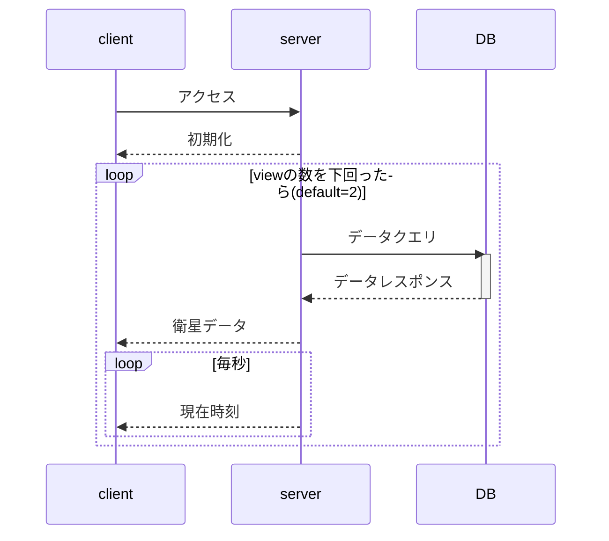

# Next Pass Viewer（公開用）

[](https://nextjs.org/) [](https://react.dev/) [](https://www.typescriptlang.org/) [](https://tailwindcss.com/) [](https://supabase.com/) [](https://vitest.dev/)

Next Pass Viewerは、衛星の通過情報をリアルタイムで表示するWebアプリケーションです。このアプリは、サーバー時間を基に衛星の通過時刻をカウントダウン表示し、ユーザーが指定した条件に基づいてデータをフィルタリングすることができます。

## 目次

- [Next Pass Viewer（公開用）](#next-pass-viewer公開用)
  - [目次](#目次)
  - [機能](#機能)
  - [インストール](#インストール)
    - [前提条件](#前提条件)
    - [手順](#手順)
    - [Supabaseなしで動かす](#supabaseなしで動かす)
  - [使い方](#使い方)
    - [URLクエリパラメータ](#urlクエリパラメータ)
    - [例](#例)
  - [API](#api)
    - [`/api/time`](#apitime)
    - [`/api/passes`](#apipasses)
  - [シーケンス図](#シーケンス図)
  - [スタイリング](#スタイリング)
    - [ハイライト](#ハイライト)
    - [新しいテーマの追加方法](#新しいテーマの追加方法)
  - [ドキュメント](#ドキュメント)
  - [お問い合わせ](#お問い合わせ)

## 機能

- **サーバー時間の表示**

  - UTCとローカル時間（JST）を`YYYY-MM-DD hh:mm:ss`形式で表示し、毎秒更新します。

- **衛星通過リストの表示**

  - 最新の衛星通過情報をリスト形式で表示します。
    - **順番**: 1st, 2nd, 3rdのように表示されます。
    - **衛星名**: 衛星の名前（不明な場合は"Unknown Satellite"と表示）。
    - **可視時間**: 衛星が見える時刻。
    - **カウントダウン（AOS/LOS）**:
      - AOS（信号取得時刻）までのカウントダウン。
      - AOS後はLOS（信号消失時刻）までのカウントダウンに切り替わります。
      - LOSが0になるとリストが自動更新され、新しい通過情報を取得します。
    - **最高仰角**: 衛星が通過する際の最大仰角。
    - **方位角**: AOS、最大時、LOS時の方位角を表示。
    - **最終更新時刻**: サーバーからデータを取得した最終時刻を表示。

- **URLクエリによるフィルタリング**

  - クエリパラメータを使用してデータをフィルタリングできます。
    - **衛星フィルタ**: 複数の衛星名を指定可能。
    - **表示件数**: `view`パラメータで表示する通過情報の件数を指定（デフォルトは2件）。

- **APIクエリの最適化**

  - `/api/time`エンドポイントはサーバー時間を毎秒取得します。
  - `/api/passes`エンドポイントは通過情報の終了時のみ新しいデータを取得し、APIへの負荷を軽減します。

## インストール

### 前提条件

- [Node.js](https://nodejs.org/)（バージョン14.x以上を推奨）
- [npm](https://www.npmjs.com/)

### 手順

1. **リポジトリをクローン**

    ```bash
    git clone https://github.com/CIT-GARDENs-Organization/next-pass-viewer-public
    cd next-pass-viewer-public
    ```

2. **依存関係のインストール**

    ```bash
    npm install
    ```

3. **環境変数の設定**

    Supabase を利用する場合は `env.local.example` をコピーして `.env.local` を作成し、環境に合わせて値を設定してください。

    ```env
    NEXT_PUBLIC_SUPABASE_URL=your_supabase_url
    NEXT_PUBLIC_SUPABASE_KEY=your_supabase_anon_key
    ```

    Supabaseの環境変数を設定しない場合でも、アプリはリポジトリに同梱されている地上局(`data/groundstations.json`)・衛星(`data/satellites.json`)・TLE情報を用いて通過情報をオンデマンドで計算します。取得した結果は`data/passes.json`に追記され、再読み込みや表示更新のたびに最新の計算結果が反映されます。

### Supabaseなしで動かす

1. `data/satellites.json` に対象衛星のTLEを2行形式で登録します。
2. `data/groundstations.json` に地上局の緯度・経度・標高を登録します。
3. アプリを起動して画面を再読み込みするたびに、登録済みの情報から通過が自動計算され、`data/passes.json`へ保存されます。

    `data/passes.json` は実行のたびに追記更新されるため、必要に応じて内容を削除してから再計算してください。

4. **実行**

    試しで実行する場合

    ```bash
    npm run dev
    ```

    本格的に実行する場合

    ```bash
    npm run build
    npm start
    ```

    実行後

    ```bash
    ▲ Next.js XX.X.X
    - Local:        http://localhost:3000
    - Network:      http://192.168.10.13:3000
    ```

    などと表示されるので、実行端末と表示端末が同じなら`Local`、異なる場合は`Network`のURLにお使いのブラウザでアクセスしてください。

## 使い方

### URLクエリパラメータ

URLの末尾に`/?`を追加することで表示内容等を変更することができます。

また、複数のクエリを使いたい場合は`&`で繋げることが出来ます。

- **SPECIALモード**: `SPECIAL`パラメータを`TRUE`に設定すると、特定の条件下でスペシャルモードが有効になります。このモードでは、音声再生などの特別な機能が動作します。

  ```url
  http://localhost:3000/?SPECIAL=TRUE
  ```

  - **テーマ指定**: `theme`パラメータを使用して、スペシャルモードで実行されるテーマが本来ランダムなのを指定することができます。

    ```url
    http://localhost:3000/?theme=default
    ```

- **衛星フィルタ**: `satellite`パラメータを使用して衛星名で通過情報をフィルタリングします。複数指定する場合は`satellite`パラメータを複数回使用します。

  ```url
  http://localhost:3000/?satellite=Satellite1&satellite=Satellite2
  ```

- **表示件数**: `view`パラメータを使用して表示する通過情報の件数を指定します。

  ```url
  http://localhost:3000/?view=5
  ```

### 例

- **特定の衛星を表示し、表示件数を3件に設定**

  ```url
  http://localhost:3000/?satellite=SatelliteA&view=3
  ```

## API

定期的にサーバー側に問い合わせる情報とその中身

### `/api/time`

`http://localhost:3000/api/time`

サーバーの現在時刻を取得します。

- **メソッド**: `GET`
- **レスポンス**:

  ```json
  {
    "utc": "2025-01-14T09:37:23Z"
  }
  ```

### `/api/passes`

`http://localhost:3000/api/passes`

衛星通過情報を取得します。

- **メソッド**: `GET`

- **クエリパラメータ**:

  - `satellite`（オプション）: 衛星名でフィルタリング（複数指定可能）。
  - `view`（オプション）: 表示する通過情報の件数（デフォルトは2件）。
  - `start_time`（オプション）: 通過情報取得の開始時刻。

Supabaseの接続情報が未設定の場合は、`data/satellites.json` と `data/groundstations.json` に登録されたTLE・地上局を元に通過を計算し、その結果が`data/passes.json`に保存された上でレスポンスとして返されます。レスポンスフォーマットはSupabase利用時と同じになるよう調整されているため、フロントエンドの実装を切り替える必要はありません。

- **レスポンス**:

  ```json
  [
    {
      "aos_time": "2025-01-14T09:37:23Z",
      "los_time": "2025-01-14T09:42:23Z",
      "satellites": {
        "name": "SatelliteA"
      },
      "max_elevation": 45.5,
      "aos_azimuth": 180.0,
      "max_azimuth": 270.0,
      "los_azimuth": 360.0,
      "time_mode": "AOS",
      "remainingTime": 300000
    }
  ]
  ```

## シーケンス図



## スタイリング

このアプリケーションはダークテーマを基調としたデザインで、モバイルデバイスにも対応したレスポンシブレイアウトです。

### ハイライト

- **背景色**: 黒
- **文字色**: 白
- **フォント**: Arial, sans-serif
- **レイアウト**: Flexboxを使用した中央揃え
- **レスポンシブデザイン**: 画面幅600px以下の場合、1列レイアウトに変更

詳細なスタイルについては[`global.css`](./app/global.css)および[`/public/themes`](./public/themes)内のテーマファイルを参照してください。

### 新しいテーマの追加方法

1. `public/themes/`フォルダ内に新しいCSSファイルを作成します。
   - 例: `my-new-theme.css`

   ```css
   /* my-new-theme.css */
   body {
       background-color: #123456;
       color: #ffffff;
   }

   .card {
       border: 2px solid #abcdef;
       background-color: #234567;
   }
   ```

2. テーマ固有のスタイルを定義します。

3. `layout.tsx`で新しいテーマをインポートし、`THEMES`オブジェクトを更新します。
   - 以下は`layout.tsx`の例です。

   ```tsx
   import "../public/themes/my-new-theme.css";

   const THEMES = {
       default: {
           classes: {
               twentyMin: "alert-20min-default",
               fifteenMin: "alert-15min-default",
               los: "alert-los-default"
           }
       },
       "my-new-theme": {
           classes: {
               twentyMin: "alert-20min-new",
               fifteenMin: "alert-15min-new",
               los: "alert-los-new"
           }
       }
   };
   ```

4. テーマのクラス名を既存のロジックに統合し、動作確認を行います。

これにより、新しいテーマがアプリケーションで選択可能になります。

1. `public/themes/`フォルダ内に新しいCSSファイルを作成します。
2. テーマ固有のスタイルを定義します。
3. `layout.tsx`で新しいテーマをインポートし、コード内の`THEMES`オブジェクトを更新します。

例:

```tsx
import "../public/themes/your-theme.css";

const THEMES = {
    default: { ... },
    "your-theme": { ... }
};
```

## ドキュメント

- [CONTRIBUTING.md](CONTRIBUTING.md): コントリビューションガイドライン
- [CODE_OF_CONDUCT.md](CODE_OF_CONDUCT.md): 行動規範
- [docs/architecture.md](docs/architecture.md): アーキテクチャ概要
- [env.local.example](env.local.example): 環境変数サンプル

## お問い合わせ

質問や問題がある場合は、[GitHub Issues](https://github.com/CIT-GARDENs-Organization/next-pass-viewer-public/issues)をご利用ください。

